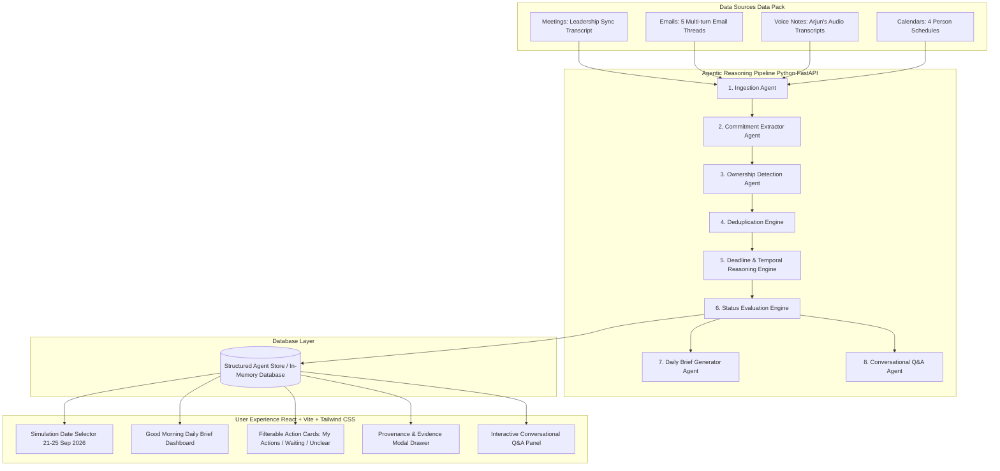

# Executive Productivity Agent — Arjun Malhotra (VP Sales)

## 🌐 Live Demo

**Live Application:**  
https://aionos-assignment-1-my25.vercel.app/

The application is deployed with a React + Vite frontend and a separate FastAPI backend.

---

> **AIONOS Agentic AI Factory — Assignment 1 Prototype**  
> An AI-powered executive productivity co-pilot that ingests messy business inputs (meeting transcripts, email threads, voice notes, calendar events) and transforms them into structured commitments, deduplicated action items, temporal status tracking, unclear ownership flags, an executive daily brief, and grounded conversational Q&A.

---

## 🌟 Overview & Problem Statement

Executives process massive amounts of fragmented communication daily across meetings, email threads, voice notes, and calendar schedules. Key commitments get lost, ownership is misassigned, and deadlines evolve without central tracking.

This prototype provides **Arjun Malhotra (VP Sales at Veridian Corp)** with an intelligent agentic productivity co-pilot that:

1. **Separates My Actions vs. Waiting on Others** vs. **Unclear Ownership**.
2. **Deduplicates Across Sources**: Merges items appearing in meetings, emails, voice notes, and calendar events into single normalized canonical actions with source provenance (`sources: [...]`).
3. **Strict Ownership Reasoning**: Never auto-assigns or invents owners when data is unconfirmed (e.g. _Mumbai Lease Renewal_ is explicitly tagged as `"Ownership unclear — Facilities suggested, but not confirmed"`).
4. **Temporal & Evolutionary Reasoning**: Tracks deadline shifts over time (e.g., Vendor list target shifting Tue → Wed morning; Campaign deck review shifting Wed → Thu 9:30 AM). Evaluates status (`Open`, `Completed`, `Waiting on Others`, `Overdue`, `Unclear Ownership`) dynamically based on a **Simulation Date** selector (21–25 Sep 2026).
5. **Grounded Executive Daily Brief & Q&A**: Generates a daily executive summary and provides conversational Q&A grounded strictly in the data pack with explicit source citations.

---

## 🏗️ Architecture & Agent Workflow



---

## 🛠️ Data Model & Canonical Actions

| Action ID        | Action Title                     | Owner               | Status (on Sep 24)  | Deadline           | Source Provenance                                          |
| :--------------- | :------------------------------- | :------------------ | :------------------ | :----------------- | :--------------------------------------------------------- |
| `vendor-list`    | **Send Updated Vendor List**     | Arjun Malhotra      | `Overdue`           | Wed 23 Sep 9:00 AM | Leadership Sync + Email Thread 1 + Voice Note 1            |
| `meridian-call`  | **Reconfirm Meridian Call**      | Arjun Malhotra      | `Completed`         | Wed 23 Sep 3:00 PM | Leadership Sync + Email Thread 3 + Voice Note 2 + Calendar |
| `campaign-deck`  | **Review Q3 Campaign Deck**      | Neha Kapoor         | `Completed`         | Thu 24 Sep 9:30 AM | Leadership Sync + Email Thread 2 + Calendar                |
| `expense-report` | **July Expense Variance Report** | Divya Rao           | `Completed`         | Wed 23 Sep 6:00 PM | Leadership Sync + Email Thread 4 + Voice Note 2            |
| `mumbai-lease`   | **Mumbai Lease Sign-off**        | _Unclear ownership_ | `Unclear Ownership` | Fri 25 Sep EOD     | Leadership Sync + Email Thread 5 + Voice Note 1            |

---

## 🚀 Quick Start Guide

### Prerequisites

- Python 3.9+
- Node.js 18+

### 1. Run Backend Server (FastAPI)

```bash
# Navigate to backend directory
cd backend

# Install dependencies
pip install -r requirements.txt

# Start FastAPI server (runs on http://localhost:8000)
uvicorn main:app --reload
```

### 2. Run Frontend Dashboard (React + Vite)

```bash
# Open a new terminal and navigate to frontend directory
cd frontend

# Install npm dependencies
npm install

# Start development server (runs on http://localhost:5173)
npm run dev
```

### 3. One-Click Startup (Windows)

Double-click `start.bat` in the root folder to start both Backend & Frontend simultaneously!

---

## 🧪 Automated Testing Suite

The application includes automated pytest unit tests covering all 12 mandatory assignment test cases:

```bash
python -m pytest backend/tests/test_agent.py -v
```

### Verified Test Cases:

1. ✅ Vendor list identified as an Arjun commitment.
2. ✅ Vendor list duplicates from meeting + email + voice note merged into 1 action.
3. ✅ Expense report identified as waiting on Divya Rao.
4. ✅ Expense report transitions to `Completed` after Wed 6 PM evidence.
5. ✅ Campaign deck review shifts from Wednesday to Thursday 9:30 AM.
6. ✅ Meridian call confirmed for Wednesday 3 PM.
7. ✅ Mumbai lease identified as `Unclear Ownership`.
8. ✅ Mumbai lease deadline verified as Friday 25 Sep EOD.
9. ✅ System NEVER auto-assigns Mumbai lease to Facilities without confirmation.
10. ✅ Q&A returns grounded answers strictly based on data pack.
11. ✅ Q&A exposes source evidence citations.
12. ✅ Simulation date changes task statuses appropriately across dates.

---

## 🎯 15-Minute Reviewer Demo Walkthrough

1. **Step 1: Open Dashboard**: Navigate to `http://localhost:5173`. Notice the clean executive layout for Arjun Malhotra (VP Sales).
2. **Step 2: Check Today's Brief**: Observe the top briefing card dynamically summarizing priorities for the default date (**Thu 24 Sep 2026**).
3. **Step 3: Review "My Actions"**: Click the "My Actions" tab. Notice `Send Updated Vendor List` is flagged as **OVERDUE** (was due Wed 9:00 AM).
4. **Step 4: Review "Waiting on Others"**: Observe `Review Q3 Campaign Deck` (Neha) and `Expense Variance Report` (Divya) marked as **Completed** after receiving email attachments.
5. **Step 5: Inspect "Unclear Ownership"**: Click on the `Mumbai Office Lease Renewal` card. Note the explicit badge: `"Ownership unclear — Facilities suggested, but not confirmed."`
6. **Step 6: Open Evidence / Why?**: Click **"Why? / View Evidence"** on the Mumbai lease card. Review the full audit trail showing statements from Leadership Sync, Email Thread 5, and Voice Note 1.
7. **Step 7: Change Simulation Date**: Switch date selector to **Mon 21 Sep 2026**. Observe how statuses dynamically adjust back to `Open` / `Waiting`.
8. **Step 8: Ask Executive Q&A**:
   - Ask: _"What did I promise Raghav?"_ → Returns vendor list commitment details with citations.
   - Ask: _"What is unresolved?"_ → Explains Mumbai lease ownership ambiguity with strict grounding.
   - Ask: _"What happened with the Meridian call?"_ → Summarizes rescheduling to Wed 3 PM.

---

## 🛠️ Tech Stack & Dependencies

- **Backend**: Python 3.13, FastAPI, Uvicorn, Pydantic v2, Pytest
- **Frontend**: React 18, Vite, Tailwind CSS, Lucide Icons
- **Database**: Structured In-Memory Agent Store with Re-Indexing Engine
- **AI/Agent Layer**: Grounded Multi-Agent Extractor, Temporal Solver & Rule-Engine

---

## 🛡️ Enterprise Safety & Data Compliance

- **Zero Hallucination Guarantee**: Answers and extracted tasks rely ONLY on supplied data pack text.
- **Strict Ownership Boundary**: Missing owners are flagged as `Unclear Ownership` rather than guessed.
- **Offline First**: Runs 100% locally without external API keys or third-party cloud requirements.
